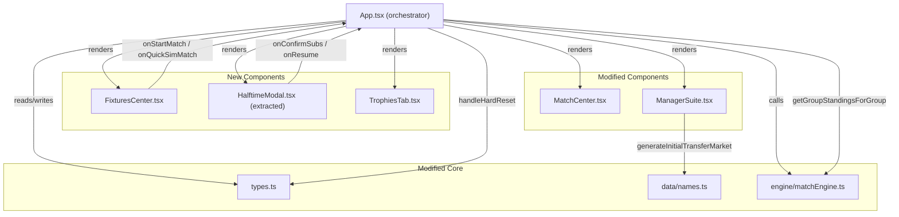

# Design Document — Season Overhaul

## Overview

The Season Overhaul extends Sportsim-Pro with nine interconnected improvements across UI, game logic, and data model. The work touches the main `App.tsx` orchestrator, the match simulation layer, the `types.ts` data model, three new components (`FixturesCenter`, `HalftimeModal`, `TrophiesTab`), the transfer market generator in `ManagerSuite.tsx`, and the group-stage qualification logic. A README update and GitHub push complete the release.

The design follows the existing pattern of the codebase: React 18 functional components with `useState`/`useEffect`, a localStorage-backed save slot system, and a Tailwind CSS dark-theme UI. No new runtime dependencies are introduced; the only new dev-facing tooling is `fast-check` (a TypeScript property-based testing library) added as a `devDependency`.

---

## Architecture



The central state lives in `App.tsx`. Child components receive data as props and emit events upward — the same pattern already in use throughout the codebase. No global state library (Redux, Zustand) is introduced.

---

## Components and Interfaces

### 1. `FixturesCenter` (new — `src/components/FixturesCenter.tsx`)

Replaces/extends the fixtures view. Receives all fixtures and bracket nodes as props.

```typescript
interface FixturesCenterProps {
  userClubId: string;
  allClubs: Club[];
  currentWeek: number;
  leagueFixtures: Fixture[];
  tournamentFixtures: Fixture[];
  cupBracket: BracketNode[];
  onStartMatch: (fixtureId: string, homeId: string, awayId: string, isSpectating: boolean) => void;
  onQuickSimMatch: (fixtureId: string, homeId: string, awayId: string) => void;
}
```

**Internal state:**
- `activeTab: 'League' | 'Tournament'` — defaults to `'League'`

**Tab: League**
- Groups `leagueFixtures` by `week` (1–26, league weeks only)
- For each fixture row: shows club names, result (if completed), "Play" and "Quick Sim" buttons
- Play button calls `onStartMatch(..., isSpectating)` where `isSpectating = !(homeId === userClubId || awayId === userClubId)`

**Tab: Tournament**
- Group stage (weeks 3, 6, 9): groups `tournamentFixtures` by `week`
- Knockout rounds: renders `cupBracket` nodes grouped by `round` (R16, QF, SF, F)
- Same Play / Quick Sim buttons with same `isSpectating` derivation

**Completed fixture display:**
- Shows `homeScore – awayScore` badge
- Both Play and Quick Sim remain visible (replay / re-simulate)

---

### 2. `HalftimeModal` (new — `src/components/HalftimeModal.tsx`)

Extracted from the existing inline JSX in `App.tsx` and redesigned.

```typescript
interface HalftimeModalProps {
  isOpen: boolean;
  userClub: Club;
  subsUsed: number;            // substitutions already made this interval
  onConfirmSub: (starterId: string, benchId: string) => void;
  onResume: () => void;
}
```

**Internal state:**
- `posFilter: 'ALL' | 'GK' | 'DEF' | 'MID' | 'ATT'`
- `staminaFilter: 'ALL' | 'below70' | 'below50'`
- `selectedStarterId: string | null`
- `selectedBenchId: string | null`
- `pendingSwapAnimation: boolean` — true for 400 ms after confirming swap

**Layout:**
- Top strip: "Half-Time" header + substitutions counter `{subsUsed} / 3`
- Filter row: position pills + stamina threshold dropdown
- Two-column grid: **Starters** (left, green tint) | **Bench** (right, grey tint)
- Each player row: name, position badge, stamina bar (coloured red below 50, amber below 70, green otherwise)
- Animated swap: when `pendingSwapAnimation === true`, the two affected rows get a highlight pulse
- "Confirm & Resume" button at bottom — disabled if `selectedStarterId === null || selectedBenchId === null`

**Sub limit:**
- When `subsUsed >= 3` any click on a player shows an inline error; Confirm button is disabled
- `onConfirmSub` is called only if the incoming total would be ≤ 3

---

### 3. `TrophiesTab` (new — `src/components/TrophiesTab.tsx`)

```typescript
interface TrophiesTabProps {
  trophyHistory: TrophyEntry[];
}
```

**Empty state:** renders a centred trophy icon + message "No trophies awarded yet. Complete a season to begin your legacy."

**Non-empty state:** groups entries by `season` descending; for each season shows a card with:
- League Champion (club name or "N/A")
- Cup Champion (club name or "N/A")
- League Golden Boot (player name, club, goals — or "N/A")
- Tournament Golden Boot
- League Golden Glove (GK name, club, saves — or "N/A")
- Tournament Golden Glove

---

### 4. `MatchCenter` (modified — `src/components/MatchCenter.tsx`)

Add `isSpectating` prop (derived from `simulation.isSpectating`):

```typescript
// Additional prop
isSpectating: boolean;
```

- When `isSpectating === true`: the "In-Play Tactics Board" section (mentality selector) is hidden entirely (`display: none` equivalent via conditional render)
- Play/pause and step-forward buttons remain functional regardless of `isSpectating`

---

### 5. `ManagerSuite` (modified — transfer market only)

`generateInitialTransferMarket()` is refactored to:
- Generate exactly 60+ players (target: 64 for clean position splits)
- Guarantee distribution constraints (see Data Models section)
- Apply the revised pricing multipliers

---

## Data Models

### New types in `types.ts`

```typescript
export interface GoldenBootEntry {
  playerName: string;
  clubName: string;
  goals: number;
}

export interface GoldenGloveEntry {
  playerName: string;
  clubName: string;
  saves: number;
}

export interface TrophyEntry {
  season: number;
  leagueChampion: string | null;        // club name or null
  cupChampion: string | null;           // club name or null
  leagueGoldenBoot: GoldenBootEntry | null;
  tournamentGoldenBoot: GoldenBootEntry | null;
  leagueGoldenGlove: GoldenGloveEntry | null;
  tournamentGoldenGlove: GoldenGloveEntry | null;
}
```

### `SaveSlot` additions

```typescript
interface SaveSlot {
  // ... existing fields ...
  trophyHistory: TrophyEntry[];  // persists across resets; never cleared
  seasonNumber: number;          // increments on each handleHardReset
}
```

Migration: when loading a save slot that lacks these fields, default `trophyHistory` to `[]` and `seasonNumber` to `1`.

### Transfer Market — distribution algorithm

Target pool size: **64 players** (16 per position × 4).

Position caps:
- Min 8 per position, max ≤ 40% of 64 = 25 per position
- Balanced split: 16 GK, 16 DEF, 16 MID, 16 ATT (each = 25% < 40% ✓, each ≥ 8 ✓)

Rating distribution (applied across all 64 players):
- **Elite tier** (83–99 OVR): ≥ 30% = ≥ 20 players → generate 24 (37.5%)
  - Sub-tier 83–89: use `valFactor × 0.65`
  - Sub-tier 90+: use `valFactor × 0.75`
- **Mid tier** (70–82 OVR): remaining majority, ~32 players
- **Prospect tier** (62–69 OVR): ≤ 20% = ≤ 12 players → generate 8 (12.5%)

Generation strategy: build the pool in ordered tiers, then shuffle before returning.

Pricing formula (base formula unchanged):
```typescript
const valFactor = Math.pow(rating - 55, 3.1) * 12500;

let multiplier = 1.0;
if (rating >= 90) multiplier = 0.75;
else if (rating >= 83) multiplier = 0.65;

const calculatedValue = Math.round((valFactor * multiplier) / 50000) * 50000;
```

### Season Reset — fields cleared by `handleHardReset`

**Per club:**
```
points, played, won, drawn, lost, goalsFor, goalsAgainst, goalDifference, streak
```

**Per player (all players in all clubs):**
```
goals, assists, yellowCards, redCards, saves,
tournamentGoals, tournamentAssists, tournamentYellowCards, tournamentRedCards, tournamentSaves,
matchRatings (→ [])
```

**Not cleared:**
- `trophyHistory` (persists)
- `userBalance` (retains carry-over budget; reset to `START_BUDGET` only if user explicitly chooses "fresh start" — see App.tsx flow)

### Group-Stage Qualification

After all Week 9 fixtures are completed, `App.tsx` runs:

```typescript
// Pseudo-code for the advance logic
const allWeek9Done = tournamentFixtures
  .filter(f => f.week === 9)
  .every(f => f.isCompleted);

if (allWeek9Done) {
  const qualifiers: string[] = [];
  for (let g = 0; g < 8; g++) {
    const standings = getGroupStandingsForGroup(g, allClubs, tournamentFixtures);
    // standings[0] = group winner, standings[1] = group runner-up
    qualifiers.push(standings[0].club.id); // [0, 2, 4, 6, 8, 10, 12, 14] = winners
    qualifiers.push(standings[1].club.id); // [1, 3, 5, 7, 9, 11, 13, 15] = runners-up
  }
  // qualifiers layout: [A-win, A-run, B-win, B-run, C-win, C-run, ...]

  // Seeding: pair group winner vs runner-up from ADJACENT group
  // R16-1: qualifiers[0] (A-win) vs qualifiers[3] (B-run)
  // R16-2: qualifiers[2] (B-win) vs qualifiers[1] (A-run)
  // R16-3: qualifiers[4] (C-win) vs qualifiers[7] (D-run)
  // ... continuing for all 8 pairs
  const seededQualifiers: string[] = [];
  for (let i = 0; i < 8; i++) {
    seededQualifiers.push(qualifiers[i * 2]);     // group winner
    seededQualifiers.push(qualifiers[i * 2 + 3 - (i % 2 === 0 ? 0 : 2)]); // adjacent runner-up
  }
  // Then call generateCupBracket16FromGroups(seededQualifiers)
}
```

The `generateCupBracket16FromGroups` function already constructs 8 R16 + 4 QF + 2 SF + 1 Final nodes (15 total) from a flat 16-element array, so only the caller logic needs correction.

The exact seeding pattern per the requirement:
- R16 pair 1: GroupA winner vs GroupB runner-up
- R16 pair 2: GroupB winner vs GroupA runner-up
- R16 pair 3: GroupC winner vs GroupD runner-up
- R16 pair 4: GroupD winner vs GroupC runner-up
- R16 pair 5: GroupE winner vs GroupF runner-up
- R16 pair 6: GroupF winner vs GroupE runner-up
- R16 pair 7: GroupG winner vs GroupH runner-up
- R16 pair 8: GroupH winner vs GroupG runner-up

This produces the 16-element `seededQualifiers` array consumed by `generateCupBracket16FromGroups`.

### Trophy Recording — season end trigger

A season ends when **both** conditions are true:
1. All Week 26 league fixtures are completed
2. The `cupBracket` Final node is completed (`currentCupRound === 'FINISHED'`)

When this occurs (checked inside `handleFinalizeAndSettleMatch`):

```typescript
function computeSeasonTrophies(
  allClubs: Club[],
  leagueFixtures: Fixture[],
  cupBracket: BracketNode[],
  seasonNumber: number
): TrophyEntry {
  // League champion: club with highest points in league table
  const leagueChampion = [...allClubs]
    .sort((a, b) => b.points - a.points || b.goalDifference - a.goalDifference)[0]?.name ?? null;

  // Cup champion: winner of Final bracket node
  const final = cupBracket.find(n => n.round === 'F' && n.isCompleted);
  const cupChampion = allClubs.find(c => c.id === final?.winnerClubId)?.name ?? null;

  // League Golden Boot: player with most goals (league fixtures)
  const allPlayers = allClubs.flatMap(c => c.squad);
  const leagueBootPlayer = allPlayers.reduce((best, p) =>
    p.goals > (best?.goals ?? -1) ? p : best, null as Player | null);

  // Tournament Golden Boot: player with most tournamentGoals
  const cupBootPlayer = allPlayers.reduce((best, p) =>
    (p.tournamentGoals ?? 0) > (best?.tournamentGoals ?? -1) ? p : best, null as Player | null);

  // Golden Gloves: GK with most saves / tournamentSaves
  const gks = allPlayers.filter(p => p.position === 'GK');
  const leagueGlovePlayer = gks.reduce((best, p) =>
    (p.saves ?? 0) > (best?.saves ?? -1) ? p : best, null as Player | null);
  const cupGlovePlayer = gks.reduce((best, p) =>
    (p.tournamentSaves ?? 0) > (best?.tournamentSaves ?? -1) ? p : best, null as Player | null);

  const findClubName = (playerId: string) =>
    allClubs.find(c => c.squad.some(p => p.id === playerId))?.name ?? 'Unknown';

  return {
    season: seasonNumber,
    leagueChampion,
    cupChampion,
    leagueGoldenBoot: leagueBootPlayer
      ? { playerName: leagueBootPlayer.name, clubName: findClubName(leagueBootPlayer.id), goals: leagueBootPlayer.goals }
      : null,
    tournamentGoldenBoot: cupBootPlayer
      ? { playerName: cupBootPlayer.name, clubName: findClubName(cupBootPlayer.id), goals: cupBootPlayer.tournamentGoals ?? 0 }
      : null,
    leagueGoldenGlove: leagueGlovePlayer
      ? { playerName: leagueGlovePlayer.name, clubName: findClubName(leagueGlovePlayer.id), saves: leagueGlovePlayer.saves ?? 0 }
      : null,
    tournamentGoldenGlove: cupGlovePlayer
      ? { playerName: cupGlovePlayer.name, clubName: findClubName(cupGlovePlayer.id), saves: cupGlovePlayer.tournamentSaves ?? 0 }
      : null,
  };
}
```

---

## Correctness Properties

*A property is a characteristic or behavior that should hold true across all valid executions of a system — essentially, a formal statement about what the system should do. Properties serve as the bridge between human-readable specifications and machine-verifiable correctness guarantees.*

Property-based testing is applicable here for the pure logic functions: fixture tab filtering, `isSpectating` derivation, half-time sub enforcement, transfer market distribution, season reset invariants, trophy computation, and group-stage qualification. All properties will be implemented with [**fast-check**](https://fast-check.dev/) configured to run 200 iterations per property.

---

### Property 1: League tab filter

*For any* list of league and tournament fixtures, when the active tab is "League", the set of displayed fixture IDs is the exact subset whose source is `leagueFixtures` — no tournament fixture ever appears.

**Validates: Requirements 1.2**

---

### Property 2: Tournament tab filter

*For any* list of league and tournament fixtures plus bracket nodes, when the active tab is "Tournament", no league fixture appears in the rendered output.

**Validates: Requirements 1.3**

---

### Property 3: Completed fixture always shows score

*For any* completed fixture (with `isCompleted === true`, `homeScore` and `awayScore` defined), the rendered fixture row contains both score values as visible text.

**Validates: Requirements 1.9**

---

### Property 4: isSpectating set correctly on launch

*For any* fixture and user club ID, launching "Play" produces `isSpectating === true` if and only if the user club is neither the home club nor the away club.

**Validates: Requirements 1.6, 1.7, 2.1, 2.6**

---

### Property 5: Mentality selector disabled while spectating

*For any* `LiveMatchSimulation` with `isSpectating === true`, the mentality selector element is absent from or disabled in the rendered `MatchCenter` output.

**Validates: Requirements 2.2**

---

### Property 6: Halftime modal suppressed in spectator mode

*For any* simulation where `isSpectating === true` that reaches tick 15, `isHalftimeModalOpen` remains `false` and `isPlaying` transitions to `true`.

**Validates: Requirements 2.4, 2.5**

---

### Property 7: Substitution atomicity

*For any* squad of 15 players (11 starters + 4 bench), confirming a valid same-position swap updates both players' `isStarting` flags atomically — the post-swap squad still has exactly 11 starters and exactly 1 GK starter.

**Validates: Requirements 3.5, 3.6**

---

### Property 8: Three-substitution limit enforcement

*For any* squad, after exactly 3 substitutions have been confirmed, any further `onConfirmSub` call has no effect on the squad state and the error message is surfaced.

**Validates: Requirements 3.7, 3.8**

---

### Property 9: Transfer market size and distribution

*For any* invocation of the new `generateInitialTransferMarket()`, the returned pool satisfies all four constraints simultaneously:
- `pool.length >= 60`
- `pool.filter(p => p.rating >= 83).length / pool.length >= 0.30`
- `pool.filter(p => p.rating < 70).length / pool.length <= 0.20`
- For each position P in {GK, DEF, MID, ATT}: `8 <= pool.filter(p => p.position === P).length <= pool.length * 0.40`

**Validates: Requirements 4.1, 4.2, 4.3, 4.6**

---

### Property 10: Elite player pricing discount

*For any* player with `rating` in [83, 89], the computed `marketValue` is at most 65% of what the same formula would yield with a 1.0 multiplier (i.e. it uses the 0.65× multiplier); for any player with `rating >= 90`, the multiplier is 0.75×.

**Validates: Requirements 4.4, 4.5**

---

### Property 11: Season reset zeroes all club and player stats

*For any* `allClubs` array containing arbitrary non-zero stat values, after `handleHardReset` completes: every club has `points === 0`, `played === 0`, `won === 0`, `drawn === 0`, `lost === 0`, `goalsFor === 0`, `goalsAgainst === 0`, `goalDifference === 0`, and `streak.length === 0`; every player has `goals === 0`, `assists === 0`, `yellowCards === 0`, `redCards === 0`, `saves === 0`, all tournament stat variants `=== 0`, and `matchRatings.length === 0`.

**Validates: Requirements 5.1, 5.2, 5.3**

---

### Property 12: Trophy history survives season reset

*For any* `trophyHistory` array with arbitrary entries, after `handleHardReset` the `trophyHistory` in the persisted `SaveSlot` is identical to the pre-reset array (same entries, same order).

**Validates: Requirements 6.8**

---

### Property 13: Season end records correct trophy winners

*For any* `allClubs` array with arbitrary player stats, `computeSeasonTrophies` returns:
- `leagueChampion` equal to the club with the highest `points` (GD tiebreaker)
- `leagueGoldenBoot.goals` equal to the maximum `goals` value across all players
- `leagueGoldenGlove.saves` equal to the maximum `saves` value among GK players

**Validates: Requirements 6.2, 6.3, 6.4, 6.5**

---

### Property 14: Trophy display completeness

*For any* non-empty `TrophyEntry[]`, every entry's six fields are rendered in the `TrophiesTab` output — null fields render as "N/A", non-null fields render their string values.

**Validates: Requirements 6.6, 6.9**

---

### Property 15: Group standings correctness

*For any* set of completed group-stage fixtures for a single group, `getGroupStandingsForGroup` produces standings where:
- Each club's `points === won * 3 + drawn * 1`
- The sort order is: points descending → goalDifference descending → goalsFor descending
- No club appears more than once

**Validates: Requirements 7.1, 7.2**

---

### Property 16: Bracket seeding produces exactly 15 nodes

*For any* array of exactly 16 qualifier IDs, `generateCupBracket16FromGroups` returns exactly 15 `BracketNode` objects: 8 with `round === 'R16'`, 4 with `round === 'QF'`, 2 with `round === 'SF'`, and 1 with `round === 'F'`.

**Validates: Requirements 7.3, 7.4, 7.5**

---

### Property 17: Incomplete group stage prevents bracket seeding

*For any* state where at least one Week 9 tournament fixture has `isCompleted === false`, the bracket seeding code path is not executed (cupBracket remains unchanged).

**Validates: Requirements 7.6**

---

## Error Handling

### `FixturesCenter`
- If `allClubs.find(homeId)` returns undefined (data corruption), render `"Unknown"` for the club name and still show the fixture row — never crash.
- If `onQuickSimMatch` callback throws, catch and display an inline toast using the existing `simMessage` pattern.

### `HalftimeModal`
- If `onConfirmSub` is called with non-existent player IDs (stale closure), silently no-op and log a warning.
- Stamina values outside [0, 100] (possible from a corrupted save) are clamped before display.

### Transfer Market
- If `generateInitialTransferMarket()` fails to satisfy the distribution constraints after 10 retry attempts, it falls back to the previous pool (passed as an argument) and sets a user-visible error message — satisfying Requirement 4.7.

### Trophy Computation
- If `allClubs` is empty, all trophy fields are set to `null` (displayed as "N/A").
- If no GK player has `saves > 0`, the Golden Glove entry is set to `null`.

### Group Qualification
- `getGroupStandingsForGroup` guards `allClubs.slice(g * 4, g * 4 + 4)` — if fewer than 4 clubs exist for a group, it skips that group entirely and logs a console warning. This prevents incomplete fixture data from crashing the bracket seeding.

### Season Reset
- `handleHardReset` wraps `saveCurrentSlotProgress` in a try-catch; on failure it retries once, then shows a user-visible error message (using the existing `simMessage` mechanism) without corrupting the in-memory state.

### `SaveSlot` backward compatibility
- When loading an old `SaveSlot` that lacks `trophyHistory` or `seasonNumber`, the load path defaults these to `[]` and `1` respectively before dispatching to React state.

---

## Testing Strategy

### Dual-Layer Approach

Every significant behaviour is covered by both an **example-based test** (specific input/output verification) and, where a universal property exists, a **property-based test** (fast-check, 200 iterations).

### Unit / Example Tests (Vitest)

Focus areas:
- `FixturesCenter` renders correct tab labels and defaults to League
- `HalftimeModal` renders filter controls, sub counter, and Confirm button
- Completed fixture rows display score text
- `TrophiesTab` renders empty-state message when `trophyHistory === []`
- `TrophiesTab` renders "N/A" for null fields in a trophy entry
- `handleHardReset` resets `currentWeek` to 1 and `currentCupRound` to `'Group'`
- After season reset, `saveCurrentSlotProgress` is called with the correct zeroed values
- `generateCupBracket16FromGroups` with a real 16-qualifier array produces exactly 15 nodes

### Property-Based Tests (Vitest + fast-check, 200 iterations each)

Each property from the Correctness Properties section is implemented as a single `fc.assert(fc.property(...))` test. Tags use the format `Feature: season-overhaul, Property N: <title>`.

```typescript
// Example implementation sketch — Property 9
import * as fc from 'fast-check';

it('Property 9: Transfer market satisfies all distribution constraints', () => {
  // generateInitialTransferMarket uses no external input — invoke directly
  fc.assert(
    fc.property(fc.constant(null), () => {
      const pool = generateInitialTransferMarket();
      expect(pool.length).toBeGreaterThanOrEqual(60);
      const elite = pool.filter(p => p.rating >= 83).length;
      expect(elite / pool.length).toBeGreaterThanOrEqual(0.30);
      const prospect = pool.filter(p => p.rating < 70).length;
      expect(prospect / pool.length).toBeLessThanOrEqual(0.20);
      for (const pos of ['GK', 'DEF', 'MID', 'ATT'] as const) {
        const count = pool.filter(p => p.position === pos).length;
        expect(count).toBeGreaterThanOrEqual(8);
        expect(count / pool.length).toBeLessThanOrEqual(0.40);
      }
    }),
    { numRuns: 200 }
  );
});
```

### Integration / Smoke Tests
- `npm run build` produces zero TypeScript errors (verified before commit)
- localStorage round-trip: create save → reload page → assert loaded state matches saved state
- Full season simulation: new save → advance 26 weeks via quick-sim → verify `trophyHistory.length === 1`

### Testing Library and Configuration
- **Test runner:** Vitest (already in `package.json` via Vite)
- **PBT library:** `fast-check` (add as `devDependency`)
- **Component testing:** `@testing-library/react` + `jsdom` (already available with Vite/Vitest)
- Each property test tag comment: `// Feature: season-overhaul, Property N: <title>`
- Minimum **200 iterations** per property (configured via `{ numRuns: 200 }`)
